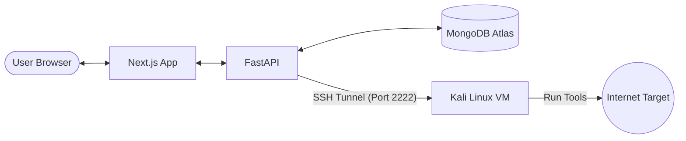

# System Design Document - OrbyTech

## 1. High-Level Architecture
OrbyTech follows a distributed client-server architecture split into three distinct layers:

1. **Frontend (Next.js):** A React-based client that manages state, user input, and polling.
2. **Backend (FastAPI):** A Python-based API gateway that manages the database and SSH orchestration.
3. **Execution Engine (Kali Linux):** A dedicated Linux VM where the actual security binaries reside.



## 2. API Design
- `POST /api/scan`: Initiates a new scan. Spawns a background task.
- `GET /api/scans`: Returns a list of all historical scans.
- `GET /api/scans/{id}`: Returns the detailed raw output for a specific scan.

## 3. Database Schema (MongoDB)
**Collection: `scans`**
```json
{
  "_id": "ObjectId",
  "target": "string (IP or Domain)",
  "status": "string (running/completed/failed)",
  "created_at": "datetime",
  "completed_at": "datetime",
  "raw_output": {
    "nmap": "string",
    "nikto": "string",
    "whatweb": "string",
    "subfinder": "string"
  }
}
```

## 4. Security Implementation
- **SSH Encapsulation:** All commands sent from the backend to Kali are wrapped in an `asyncssh` session.
- **Port Forwarding:** The backend connects to `127.0.0.1:2222`, which is mapped to the Kali VM's port 22 in VirtualBox NAT settings.
- **Timeout Management:** Each tool is governed by a 2-minute (120s) execution cap to prevent zombie processes.

## 5. UI/UX Design System
- **Theme:** Ultra-dark mode (#030305).
- **Accents:** Neon Cyan (#00f3ff) for highlights and Success Green (#00ff88) for console outputs.
- **Components:** 
  - **Glassmorphism:** Using `backdrop-filter: blur` for panels to create depth.
  - **Terminal View:** Using Monospace fonts and dark backgrounds for raw outputs.
  - **Dynamic Sidebar/Tabs:** Instant switching between tool outputs without page reloads.
