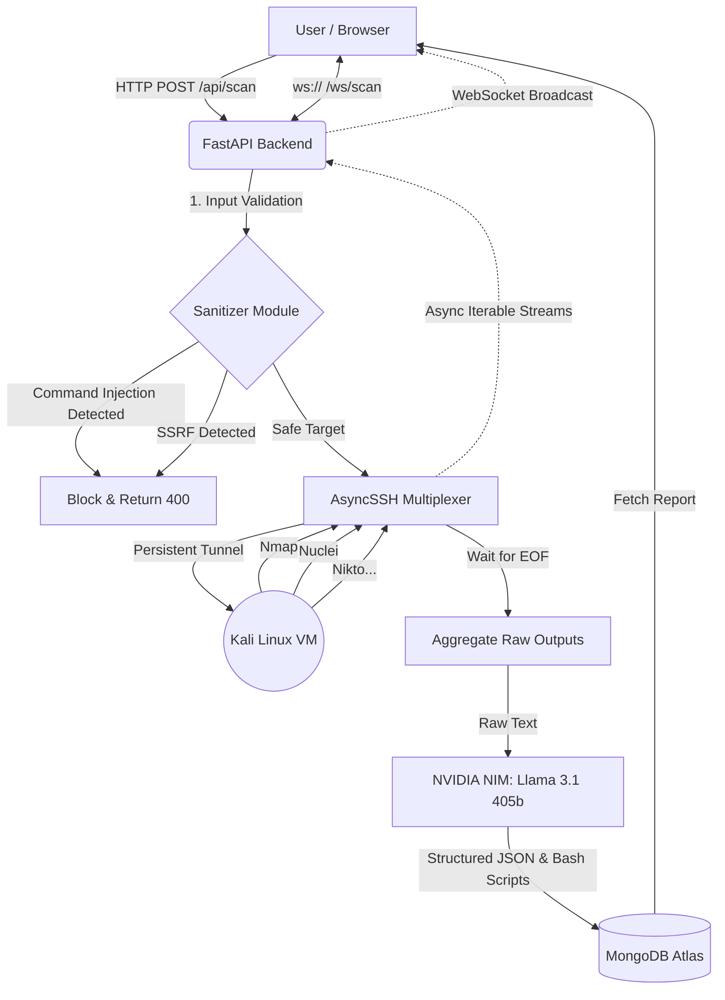

# System Design & Architecture - OrbyTech

## 1. High-Level Architecture Overview

OrbyTech implements a **Distributed, Zero-Trust Security Orchestration Model**. The frontend interacts with a central API gateway (FastAPI) via standard HTTP REST (for triggering) and WebSockets (for live streaming). The API gateway strictly validates all inputs before securely multiplexing SSH connections to a disposable / isolated Kali Linux Virtual Machine. 

Finally, raw outputs are fed to a massive Large Language Model via NVIDIA NIM for Autonomous Remediation structuring.

## 2. Component Diagram

```mermaid
graph TD
    A[User / Browser] -->|HTTP POST /api/scan| B(FastAPI Backend)
    A <-->|ws:// /ws/scan| B
    
    B -->|1. Input Validation| C{Sanitizer Module}
    C -->|Command Injection Detected| Z[Block & Return 400]
    C -->|SSRF Detected| Z
    
    C -->|Safe Target| D[AsyncSSH Multiplexer]
    D -->|Persistent Tunnel| E((Kali Linux VM))
    
    E -->|Nmap| D
    E -->|Nuclei| D
    E -->|Nikto...| D
    
    D -.->|Async Iterable Streams| B
    B -.->|WebSocket Broadcast| A
    
    D -->|Wait for EOF| F[Aggregate Raw Outputs]
    F -->|Raw Text| G[NVIDIA NIM: Llama 3.1 405b]
    
    G -->|Structured JSON & Bash Scripts| H[(MongoDB Atlas)]
    H -->|Fetch Report| A
```

## 3. Core Architectural Upgrades

### 3.1 Live Terminal Streaming (WebSocket)
We moved away from REST polling while tests run. The SSH pipeline was refactored with an asynchronous generator (`while True: line = await stdout.readline()`) mapping directly to a FastAPI `@router.websocket` endpoint. This guarantees less than 50ms latency between a tool discovering an open port in the Kali VM and it rendering on the UI.

### 3.2 Anti-SSRF & Command Injection Pipeline
Because the application executes bash commands on a remote system (`nmap -sV {target}`), we implemented a Zero-Trust module:
- Regular expressions actively drop inputs containing `;`, `|`, `&`, `$`, `` ` ``.
- IP translation occurs prior to execution, and the backend halts if the resulting IP matches `127.0.0.0/8`, `192.168.0.0/16`, `10.0.0.0/8`, or AWS Metadata addresses.

### 3.3 Autonomous Remediation (JSON Structuring)
Using prompt engineering, we forced Llama 3.1 405b to output pure, unformatted JSON containing a `remediation_script` property. The Next.js frontend detects this property and renders an interactive, copy-to-clipboard bash script directly inside the vulnerability card.

## 4. UI/UX Design Language

- **Cyberpunk Neo-Matrix Styling:** High contrast `#00ff41` against Deep Black `#030305`.
- **CRT Scanlines:** A fixed CSS overlay simulates retro monitor distortions.
- **Glassmorphism panels:** `backdrop-filter: blur(24px)` provides depth behind floating UI components and live terminals.
